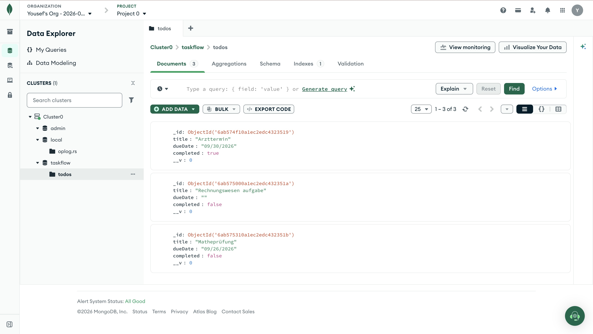

# TaskFlow (Backend)

Repository für das Backend der Anwendung **"TaskFlow"**.  
Das Backend stellt eine REST-API zur Verwaltung von Aufgaben bereit und speichert die Daten dauerhaft in einer MongoDB-Datenbank.

## Beschreibung

TaskFlow ist eine Anwendung zur Verwaltung von Aufgaben.  
Das Backend verarbeitet die Anfragen des Angular-Frontends, kommuniziert mit der MongoDB-Datenbank und stellt die benötigten CRUD-Operationen (Create, Read, Update, Delete) bereit.

Über die Anwendung können Aufgaben erstellt, angezeigt, als erledigt markiert und gelöscht werden.

## Technologien

Das Backend wurde mit folgenden Technologien realisiert:

- **Node.js**: Laufzeitumgebung für den Server
- **Express.js**: Framework für die Erstellung der REST-API
- **MongoDB Atlas**: NoSQL-Datenbank in der Cloud
- **Mongoose**: ODM zur Verbindung und Modellierung der MongoDB-Daten
- **Dotenv**: Zur Verwaltung von Umgebungsvariablen
- **CORS**: Ermöglicht Anfragen vom Angular-Frontend

## Installation & Setup

### Voraussetzungen

- **Node.js**
- **npm** (Node Package Manager)
- Ein Account bei **MongoDB Atlas**

### Schritte

1. **Repository klonen:**

```bash
git clone https://github.com/kyf12345678/WebTech26-Backend.git
cd WebTech26-Backend
```

2. **Abhängigkeiten installieren:**

```bash
npm install
```

3. **Umgebungsvariablen konfigurieren:**

Erstelle eine Datei namens `.env` im Hauptverzeichnis des Backends.

```env
DB_CONNECTION=YOUR_MONGODB_CONNECTION
DATABASE=taskflow
```

Die `.env`-Datei enthält die Zugangsdaten zur MongoDB-Datenbank und wird nicht in das Repository hochgeladen.

4. **Server starten:**

```bash
node server.js
```

Das Backend ist anschließend unter `http://localhost:3000` erreichbar.

## API-Dokumentation

Die API stellt folgende Endpunkte zur Verwaltung der Aufgaben bereit.

Sobald im Frontend eine Aktion ausgelöst wird, kommuniziert der Angular-Service über eine REST-API mit dem Backend. Die Endpunkte bilden die geforderte CRUD-Logik (Create, Read, Update, Delete) ab:

- **GET `/todos`**: Ruft alle Aufgaben aus der Datenbank ab.
- **POST `/todos`**: Erstellt eine neue Aufgabe und speichert sie in der Datenbank.
- **PUT `/todos/:id`**: Aktualisiert eine bestehende Aufgabe, zum Beispiel den Erledigt-Status.
- **DELETE `/todos/:id`**: Löscht eine Aufgabe anhand ihrer eindeutigen ID.

## Datenbankstruktur

Die Aufgaben werden mit folgendem Schema in MongoDB gespeichert:

- `title` (String): Titel der Aufgabe.
- `dueDate` (String): Fälligkeitsdatum der Aufgabe.
- `completed` (Boolean): Gibt an, ob die Aufgabe erledigt wurde.

### Datenbankstruktur & Persistenz

Die Aufgaben werden dauerhaft in der MongoDB-Datenbank gespeichert.



**Beobachtungen aus der Datenbank:**

- **Datenbestand**: Die erstellten Aufgaben werden dauerhaft in der MongoDB-Collection `todos` gespeichert.
- **Typisierung**: Die Aufgaben enthalten die im Schema definierten Datentypen `String` und `Boolean`.
- **Interaktion**: Änderungen des Erledigt-Status werden über die Update-Funktion in der Datenbank gespeichert. Gelöschte Aufgaben werden aus der Datenbank entfernt.

## CRUD

- **Create:** Neue Aufgabe erstellen
- **Read:** Aufgaben anzeigen
- **Update:** Aufgabe als erledigt markieren
- **Delete:** Aufgabe löschen

## Verzeichnis der KI-Werkzeuge

**Gemini**

- Unterstützung beim Verständnis und der Umsetzung von Angular, TypeScript und Node.js
- Hilfe bei der Fehlerbehebung und beim Debugging
- Unterstützung bei der Strukturierung des Projekts und der Dokumentation